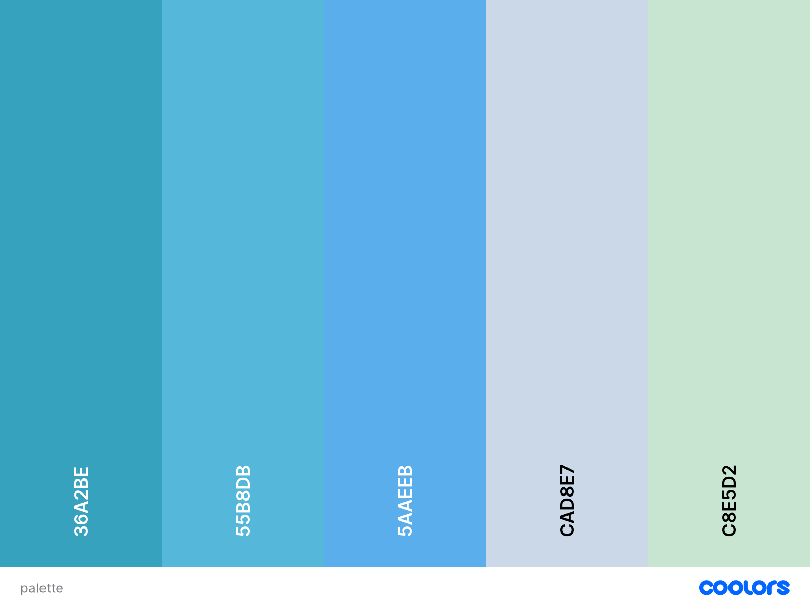
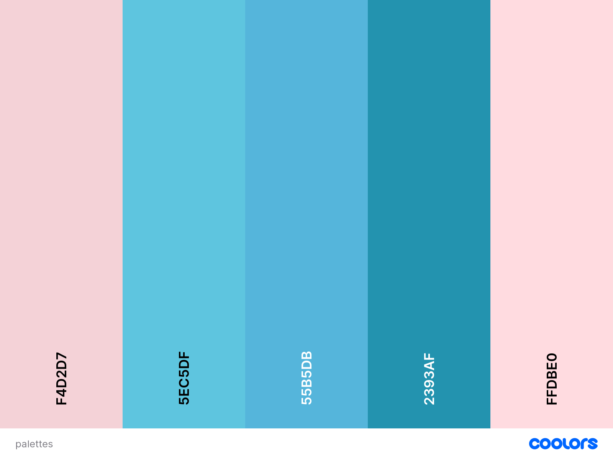
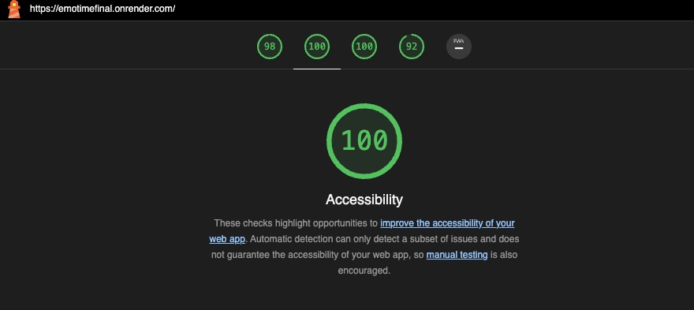
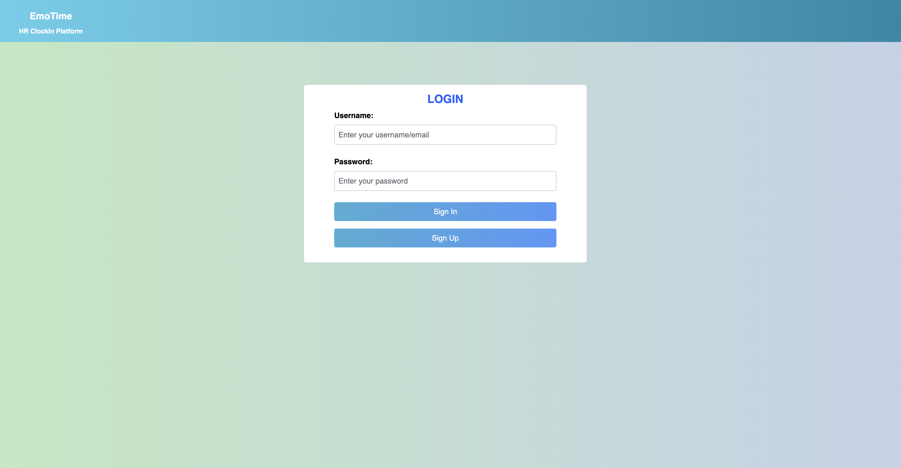
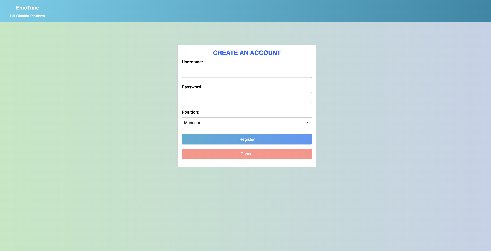
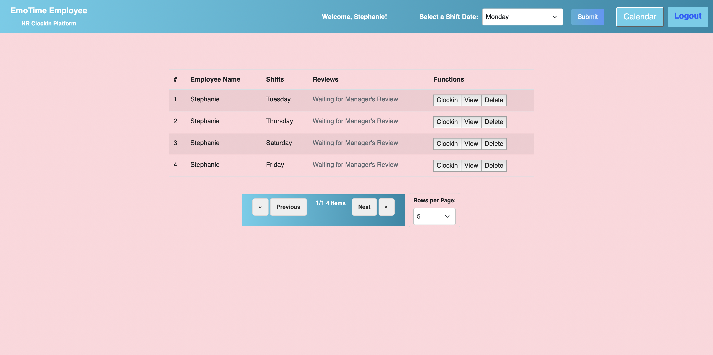
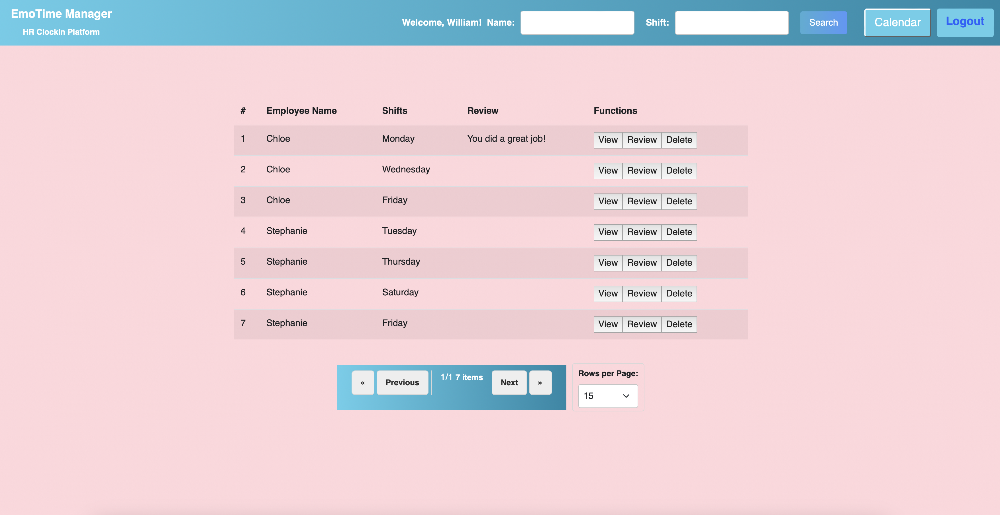
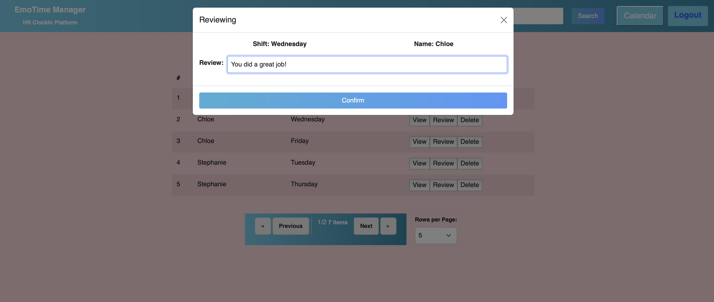
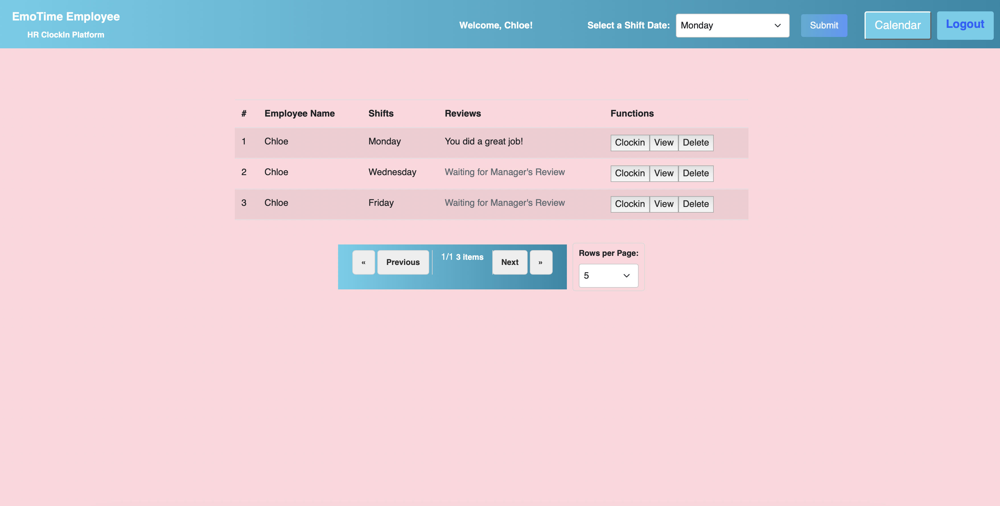

# EmoTime

**Author**: Lixing Chen, Junyi Liu

## Project Link 

[EmoTime Link](https://emotimefinal.onrender.com/)

## Presentations

[Demo Video](https://www.youtube.com/watch?v=2cqpkaeSc_g](https://www.youtube.com/watch?v=0380zYV1MJo))

[Slides](https://docs.google.com/presentation/d/1oHyjzH2UGZ7mYpVviHLmhWODuOv_OAPVzgRIB9HTQ1A/edit?usp=sharing)

[ThumbNail](https://chrischenlixing.github.io/chrisWebP1/assets/img/project3Thumbnail.jpg)

[Design Mockup](https://docs.google.com/document/d/1QPio52yecLAAEOVclxlaKdpKix84D44by-qZ4-t5M30/edit)

## Class Link

[Web Development Class - Fall 2023](https://johnguerra.co/classes/webDevelopment_fall_2023/)

## Project Objective

The goal of this project is for us to apply the concepts learned by building a basic full-stack application with Node + Express + Mongo + React. It is designed to cater to the needs of both employees and managers. Employees can easily clock in their work hours, while managers can review and monitor employee time shifts.

## Typography

Heading -- sans-serif

Paragraphs -- Arial

## Color Palettes
For the login and register pages, we used this color palette:

For the Employees and Manager pages, we used this color palette:

## Lighthouse Accessibility Report

## Install, Build & Run

1. Clone this repository.
2. Run 'npm install'.
3. Have MongoDB open
4. Run 'node start'.

## Functionalities

Authentications: The user can choose to sign up based on role and login and logout @Lixing Chen

Employee Page @Lixing Chen:

Add Shifts: Add shifts based on the dates

Clock In: Clock in for creating a timestamp

Display Shifts: Create a table to display all the added shifts for himself and see reviews

Delete Shifts: Delete the shift

Manager Page @Junyi Liu:

Search Shifts: Search shifts based on employee name/shift

Display Shifts: Create a table to display all the shifts for all employees

Check Clock In: Check the clock-in time for current employee

Review: Leave reviews for a specific shift

Delete Shifts: Delete the shift

Pagination: Display pages based on the wanted shift counts @Lixing Chen

NavBar: Display a Navbar with role and calendar @Junyi Liu

## Changes Made

Typography Update

Color Palette Implementation

Change the color contrast issue for the Lighthouse test

Authentication with Passport

Reformat the spacing of the main content and pagination

Change the format of the Navbar for the signup and login page

Add the main purpose of the app under the title

Add functionalities Delete button for the manager page doesn’t work

Fix the error for the no post when clicking the last page 

Put the search bar and addshift bar to the nav bar based on the role

Group related text and align them with alignment principles

Show the username based on the user login in the navbar

## Screenshots
Login Page:

Register Page:

Employee Page:

Manager Page:

Review:

Employee Page After Review:

